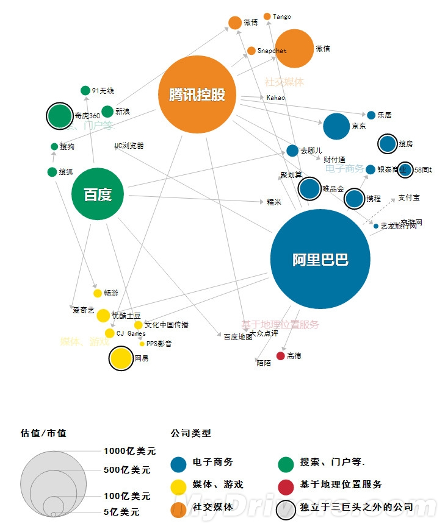

# 1. On Experience

## 1.1 Baidu Cloud

Baidu Cloud is an IAAS Platform, it provides a set of scalable, reliable, flexible, secure infrosturcture services 
for enterprises.
Its product line looks like Amazon's AWS or MS's Azure does, Ali's cloud. In china, our main competators includes Ali and Tencent.
e.g. virtral machine, storage, CDN, load-balance, message queue, database, large data analysis.

Media Services (LSS / VOD) are a collection of audio-video-oriented services. It provide live or on-demand streaming capability for our customers.
and help them manage, store and broadcast valuable audio/video content to larger audiences.
Combining with basic services, like Multimedia Cloud Transcoder, BOS, and CDN.

It can be used in many senarios: online education, sports and entertaiment live broadcast, press conference broadcast, public forum etc. 
Our customer comes from severl industries: online education startups, new media firm, government, and online game corampanies.
These companies need cloud servies to store, transcode, encrypt, and broacast large scale multimedia content in their business processes.

**Model and Protocols of LSS**
- live broadcast source - RTMP / HLS protocol, source client push stream to server or server pull stream from video source.
- LSS System: responsible for transcoding, encryption, storage, broadcast. All of these function must be implemented in a very timely fashion.
- playback on PC/Android/iOS: RTMP for low latency, HLS is used for 
HLS: stands for HTTP Live streaming, not Harvard Law School.

HLS
At a high level, HLS works like all adaptive streaming technologies; 
you create multiple files for distribution to the player, which can adaptively change streams to optimize the playback experience. 
As an HTTP-based technology, no streaming server is required, so all the switching logic resides on the player.

RTMP vs. HLS
stream vs. File/HTTP
bi-direction connection vs. one way
1~5s delay vs. > 10s delay
not compatible vs. support adaptive bitrate
interactive live vs. one-way broadcast

**Componentes**
- LSS Console / Rest Service for Live Session management, configuration, etc
- SRS clusters with FFMpeg
- 

On the video source side, we provides SDKs on android/iOS/Windows platform to capture A/V streams.
On the other side, we also provide playback SDKs on PC and mobile platforms.

**Performance**
4K+ edge nodes, 60 CDN centers all over china
each eadge server have 1Gbps bandwith
Total bandwith is 4T, 70% for HLS 30% for RTMP, this threshold number is determined by past experience.

RTMP 2~4 seconds

**Chanllenge**

### 1.1.1 Cloud
**Q1: Why Baidu develop Cloud** 
- Tech side: easy
  Ready-made team and product and Technology
  
- Business side: tough
  **Downside/Disadvange/Weakness**
  Baidu is not first-mover in this market. is a new comer.
  Ali, Tensent, JinSan Cloud, not mention Amazon, Azure, Google, Oracle, IBM, etc

  Chief director FXJ made a business report to Robin a few month ago.
  Robin didn't think 2B Cloud has Broad Prospects
  
  Defensive weapon, not offensive weapon
  **Ecosystem**
  - Spin-Off
  - Digital Marketing: Build website, Searching Engine Optmizaiont, SE Marketing, Big data analysis helpint them to improve PPC.
  - Online Education: Coursera, Andrew Ng, CSDN. is hot area of investment.
  - Govenment and state-owned enterprises.
  
  We are confident in capturing a comparably large market share in this 4 area. Especially the top three, this is our influence region. We expect handreds of million RMB revenue per years. 

**Cloud Ecosystem**
- Tencent: 
  Game live-broadcast, is strong, 
- Ali:
  E-Commerse, 

### 1.1.2 Media Services

courtroom trial of Kuaibo. totally 1 million persions watching  and 40K concurrent watch the live broadcast.
was charged internet infringement, publish video/audio content without license.

### 1.1.3 Palyer SDK

Challenges in Mobile Context
•  Unreliable Network 
•  Limited Hardware 
•  Battery Limit
•  User SenMment
•  Worldwide Users
•  Device/OS Diversity

# 1.1.5 Glossary
- online education
- live entertaiment
- sport live broadcast
- press conference live braodcast
- Propriatary Equipment
- Exclusive network access
- we have adequate network bandwith to guarantee the stability and quality for up-link stream.
- diversity of client side hardware, OS, browser, versions where our player is running on. 
- downlink network stability and bandwith, 
- Adaptive streaming: involves producing several instances of a live or on-demand source file and making them available to various clients depending upon their delivery bandwidth and CPU processing power. By monitoring CPU utilization and/or buffer status, adaptive streaming technologies can change streams when necessary to ensure continuous playback or to improve the experience.
- HTTP packets are firewall friendly and can utilize HTTP caching mechanisms on the web. This latter capability should both decrease total bandwidth costs associated with delivering the video, since more data can be served from web-based caches rather than the origin server, and improve quality of service, since cached data is generally closer to the viewer and more easily retrievable.
- overall / local target
- DNS-based scheduling algorithm 
- we have 60 machinary room, 4K+ CDN edge server all over china, each server has at most 300 Mbs bandwith, totally 1.2 T
- network jitter

## 1.2 Oracle

### 1.2.2 Visualization on App Server

### 1.2.1 JavaEE / GlassFish / WebLogic

## 1.3 Nortel

## 1.4 HW

## 1.5 PKU / SDU

# 2 Introduction
At first, let me introduce my working experience briefly, and if you are interested any part, I can drill down
to that topic and discuss it with more detail 

My working experience can be divided into 5 segments: Baidu, Oracle, Nortel, Huawei. 

pick up technology very quickly

